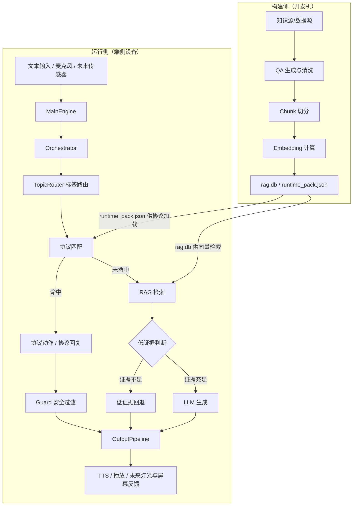

# MoniBox

MoniBox 是一个面向灾害受困场景的离线运行系统。当前仓库重点不是"功能尽量多"，而是先稳定一条可验证主链：

`文本输入 -> 协议/路由 -> RAG/低证据分流 -> 安全护栏 -> 输出`

## 项目定位与产品目标

MoniBox 面向的不是普通聊天机器人场景，而是灾害受困、断网、低算力、高风险的边缘交互场景。项目希望构建一套能够部署在端侧设备上的离线智能运行系统，使设备在缺乏网络和人工支持的情况下，仍能向受困者提供安抚、指引、问询和协议化应急响应。

核心目标不是"尽量聪明"，而是"在高风险条件下尽量可靠"。因此从设计上强调：

- **离线可运行**：不依赖稳定网络。
- **协议优先**：涉及安全和应急场景时优先走确定性规则，而不是把决策完全交给生成模型。
- **RAG 增强**：尽量让回答建立在本地知识库和结构化内容之上。
- **语音友好**：面向真实终端交互，输出必须适合播报。
- **面向边缘设备**：设计时考虑 Radxa 这类低功耗板卡的资源限制。
- **预留硬件融合能力**：未来不只做语音问答，还要和麦克风、扬声器、传感器、灯光和屏幕协同工作。

## 核心运行链路

```text
输入（文本/语音） → Engine → Orchestrator → 协议匹配 → RAG检索 → 低证据分流/LLM生成 → 安全护栏 → 响应管线 → TTS/播报
```

## 整体架构

MoniBox 按"构建侧"和"运行侧"两条主线组织。

构建侧负责把灾害、生存、急救和情绪安抚知识转成端侧可用资产：

```text
知识源/数据源 → QA 生成与清洗 → Chunk 切分 → Embedding 计算 → rag.db / runtime_pack.json
```

运行侧负责把用户输入或未来硬件事件转成协议化响应：

```text
文本/麦克风/未来传感器 → MainEngine → Orchestrator → 协议优先 → RAG/LLM/回退 → OutputPipeline → TTS/播放/未来多通道反馈
```

**构建产物与运行侧的衔接**：构建侧产出的 `rag.db` 和 `runtime_pack.json` 是运行侧的输入依赖。`Engine` 启动时会从 `build/rag.db` 加载向量数据库供 `RagEngine` 做检索；从 `build/runtime_pack.json` 和 `knowledge/` 中的协议 JSON 加载协议规则供 `ProtocolMatcher` 匹配。构建侧通常在开发机（PC）上执行，产物随版本发布到目标设备；运行侧在端侧设备上常驻，按配置路径读取这些资产。



当前阶段可以理解为：Windows 侧承担主开发、调试和语音闭环验证；Radxa Zero 3W 一类 ARM64 边缘板卡是目标运行平台，用来验证真实资源、时延、音频设备和软硬件协同表现。

## 软硬件协同

MoniBox 不是单纯的对话应用，而是为软硬件协同终端预留运行机制：

- **语音输入输出协同**：TTS 播放期间暂停 ASR，播放队列清空后再恢复监听，并通过 arm delay / post arm guard 避免设备把自己的播报重新识别进去。
- **协议事件抢占**：协议匹配具备优先级和状态处理能力，未来 IMU、震动传感器、按键等硬件事件可以转成高优先级语义事件，打断普通对话并触发应急动作。
- **多通道反馈**：`runtime/primitives.py` 已抽象 TTS、LED、屏幕接口，未来一个协议动作可以同时触发语音、灯光和屏幕短句。
- **边缘资源约束**：链路设计优先考虑低资源设备上的稳定性，包括线程协调、模型常驻、短句播报、SQLite 单文件知识库和本地模型加载策略。

## 模型与运行基线

当前主线模型与运行资产如下：

- **Embedding**：`models/embedding/bge-small-zh-v1.5`
- **RAG 存储**：SQLite + `sqlite-vec`，运行产物为 `build/rag.db` 与 `build/runtime_pack.json`
- **LLM 后端**：`deepseek`、`llama`、`auto`、`null`，统一由 `language/backends.py` 抽象；`auto` 会优先选择本地 GGUF，其次远端 DeepSeek，最后回退到 `null`
- **ASR**：Faster-Whisper，本地模型目录为 `models/asr/faster-whisper-small`
- **TTS**：推荐收敛到 `sherpa-onnx` 端侧方案，同时保留 `pyttsx3` 与 Windows `sapi` 作为兼容/过渡后端

需要特别注意的是，TTS 不只是"能发声"的模块，而是输出管线的一部分，需要同时服务于句长控制、重复抑制、音频队列播放、ASR 暂停恢复和端侧延迟控制。

## 环境管理（uv）

本项目使用 uv 作为 Python 包与环境管理工具。

### 初始化环境

```bash
# 同步核心依赖（文本模式可直接运行）
uv sync

# 同步含 DeepSeek / OpenAI API 后端
uv sync --extra remote-llm

# 同步知识库构建依赖（Embedding / DeepSeek 构建客户端）
uv sync --extra knowledge

# 同步含语音链路的完整依赖
uv sync --extra voice

# 同步含本地 LLM（llama-cpp-python，macOS 上可能需要额外编译工具链）
uv sync --extra local-llm

# 含开发依赖
uv sync --extra dev
```

### 运行项目

```bash
# 文本模式
uv run monibox --mode text

# 语音模式（单轮验收）
uv run monibox --mode mic_vad --once
```

### 常用命令

```bash
uv run --extra dev pytest        # 运行测试
uv run monibox-chat --no_llm     # 纯文本 RAG 调试入口
uv run monibox-rag --q "我好冷"   # 快速查看 RAG 检索结果
uv pip list                      # 查看已安装包
uv lock                          # 更新 uv.lock
```

## 工程结构

### 应用入口 `app/`

`monibox` 命令是唯一正式运行入口，负责启动 `MainEngine`，并提供文本模式与 VAD 语音模式。

```bash
uv run monibox --mode text
uv run monibox --mode mic_vad --once
```

### 调试工具 `devtools/`

| 文件               | 职责                           |
| ------------------ | ------------------------------ |
| `chat.py`          | 纯文本 RAG / RAG+LLM 调试入口  |
| `rag_query.py`     | 单条查询的 RAG 检索结果查看器  |
| `protocol_mock.py` | 协议优先链路的轻量 smoke check |
| `win_e2e_demo.py`  | Windows 端到端语音验证（早期） |

### 运行协调层 `core/`

| 文件           | 职责                                                                                                        |
| -------------- | ----------------------------------------------------------------------------------------------------------- |
| `engine.py`    | **Engine**：启动全局资源、创建 Orchestrator、调度 ASR/播放/协调线程、管理"监听-识别-播报-暂停-恢复"生命周期 |
| `shared.py`    | 共享基础设施：引擎事件类型、全局队列、结构化追踪日志                                                        |
| `resources.py` | 全局资源预加载与管理（ASR/TTS/LLM/RAG 延迟加载）                                                            |

### 会话与策略层 `runtime/`（业务核心）

| 文件                   | 职责                                                                                 |
| ---------------------- | ------------------------------------------------------------------------------------ |
| `orchestrator.py`      | **Orchestrator**：主编排器，协调 handle() 主流程；组装 RAG、协议、安全、TTS 等子模块 |
| `protocol_matcher.py`  | 协议匹配引擎：做协议判定与状态处理                                                   |
| `protocol_fsm.py`      | 协议 QA 状态机，处理协议命中后的动作与回复                                           |
| `slot_parser.py`       | Slot 解析器：从用户输入抽取地点、yes/no 等 slot                                      |
| `rag_engine.py`        | RAG 检索引擎，基于 SQLite + sqlite-vec 做向量检索                                    |
| `generator.py`         | RAG 生成器：将检索结果交给 LLM 组织生成回复                                          |
| `evidence_router.py`   | 低证据路由：检索证据不足时走保守输出，而非强行生成                                   |
| `guard.py`             | 安全护栏：对输出内容进行安全过滤与处理                                               |
| `rewriter.py`          | 回复改写器：适配语音播报场景                                                         |
| `response_pipeline.py` | 响应管线：整合改写、重复抑制、TTS 调度                                               |
| `preprocessor.py`      | 文本预处理器：去重、句式转换、关键词风控等                                           |
| `primitives.py`        | 运行时原语：工作记忆、重复抑制、变体库、硬件接口抽象                                 |
| `emotions.py`          | 情绪策略与策略书                                                                     |
| `runtime_config.py`    | 运行时统一配置，收敛所有环境变量读取                                                 |
| `monitor.py`           | 性能与内存监控                                                                       |
| `topic_router.py`      | 主题路由器：基于 taxonomy 做标签路由                                                 |
| `scoring.py`           | 检索结果评分/重排序策略                                                              |

### 模型能力层

#### 语言模型 `language/`

| 文件          | 职责                          |
| ------------- | ----------------------------- |
| `backends.py` | LLM 后端抽象与工厂            |
| `local.py`    | 基于 llama.cpp 的本地聊天实现 |

#### 语音链路 `speech/`

| 文件          | 职责                            |
| ------------- | ------------------------------- |
| `whisper.py`  | Faster-Whisper 语音识别实现     |
| `worker.py`   | ASR 工作线程封装                |
| `recorder.py` | 基础录音                        |
| `vad.py`      | VAD（语音活动检测）录音         |
| `pyttsx3.py`  | pyttsx3 离线 TTS                |
| `sapi.py`     | Windows SAPI TTS                |
| `sherpa.py`   | Sherpa 系列 TTS（端侧主推方案） |

### 设备抽象层 `devices/`

| 目录/文件   | 职责       |
| ----------- | ---------- |
| `player.py` | 音频播放器 |

### 数据与构建层

| 目录             | 职责                                                                        |
| ---------------- | --------------------------------------------------------------------------- |
| `knowledge/`     | 本地知识库资产：协议、策略、标签别名、情感策略、审核策略、chunk 元数据等    |
| `build/`         | 本地构建产物：`rag.db`、`runtime_pack.json`、日志与评测结果；默认不提交 Git |
| `models/`        | 本地模型资产；当前保留必要的轻量模型元数据和音色样例                        |
| `sql/schema.sql` | SQLite 数据库表结构定义                                                     |

### 配置层 `profiles/`

| 文件                          | 职责                                                      |
| ----------------------------- | --------------------------------------------------------- |
| `radxa.yaml` / `windows.yaml` | 平台级基线配置                                            |
| `*_mvp.yaml` / `radxa_*.yaml` | 运行配置文件（extreme、full、light、text_mvp、voice_mvp） |

### 测试层 `tests/`

`tests/` 存放自动化回归测试，当前主要覆盖项目路径、配置加载和重构后的目录约定。

### 知识库工具层 `knowledgekit/`

| 文件             | 职责                              |
| ---------------- | --------------------------------- |
| `client.py`      | DeepSeek API 客户端（构建期生成） |
| `embedder.py`    | Embedding 计算                    |
| `splitter.py`    | 文本切分（TTS 适配）              |
| `taxonomy.py`    | 知识分类体系                      |
| `schema.py`      | Chunk schema 定义与校验           |
| `fingerprint.py` | 文本指纹去重                      |
| `parser.py`      | LLM JSON 输出解析                 |
| `store.py`       | sqlite-vec 向量数据库封装         |
| `tags.py`        | 标签注册与归一化                  |

## 核心调用链（以语音模式为例）

```text
monibox --mode mic_vad
  └─ Engine.start()
       ├─ 启动 ASR 线程 (speech.whisper / speech.worker)
       ├─ 启动音频播放线程
       ├─ 创建 Orchestrator
       └─ 协调线程调度事件队列
            └─ Orchestrator.handle(user_input)
                 ├─ TopicRouter 标签路由
                 ├─ ProtocolMatcher 协议匹配
                 │    ├─ 命中 → ProtocolFsm 执行协议动作/回复
                 │    │              → Guard 安全过滤 → OutputPipeline.emit
                 │    └─ 未命中 → RagEngine 向量检索
                 │                   ├─ 低证据 → EvidenceRouter 回退 → OutputPipeline.emit
                 │                   └─ 正常 → Generator LLM 生成 → OutputPipeline.emit
                 └─ OutputPipeline 内部: Rewriter → RepeatGuard → Guard → TTS → 音频播放
```

## 关键设计特点

1. **协议优先**：高风险应急场景优先命中确定性协议，不依赖模型自由发挥。
2. **离线运行**：ASR、Embedding、LLM、TTS 全部本地部署，不依赖网络。
3. **RAG 增强**：回答建立在本地 `rag.db` 知识库检索之上。
4. **低证据分流**：检索证据不足时走保守策略，避免生成幻觉内容。
5. **硬件预留**：`primitives.py` 中的 `HardwareIface` 已抽象 TTS/LED/屏幕接口，未来可直接对接 Radxa 真实外设。

## 当前重点与下一步

MoniBox 已经从概念原型进入系统雏形阶段：文本主链可以验证协议、RAG、低证据分流和输出逻辑；语音主链已经形成统一入口、ASR、TTS、播放队列和运行协调框架。后续工作重点不再只是继续加功能，而是把"可跑"收敛到"可稳定部署"。

当前最需要优先推进的方向：

- **TTS 主线收敛**：统一默认配置、推荐模型目录、模型类型和运行参数，减少 `pyttsx3`、`sapi`、`sherpa` 多后端之间的理解成本。
- **目标硬件验证**：在 Radxa 目标设备上验证 ASR、TTS、RAG、LLM/回退、播放队列和长时间运行稳定性。
- **硬件事件接入**：把传感器、按键或外设中断转成运行时高优先级语义事件，并接入协议抢占链路。
- **系统性能画像**：沉淀 CPU、内存、RTF、线程数、端到端时延、温升和降频风险，形成 Windows 与 Radxa 两套清晰基线。
