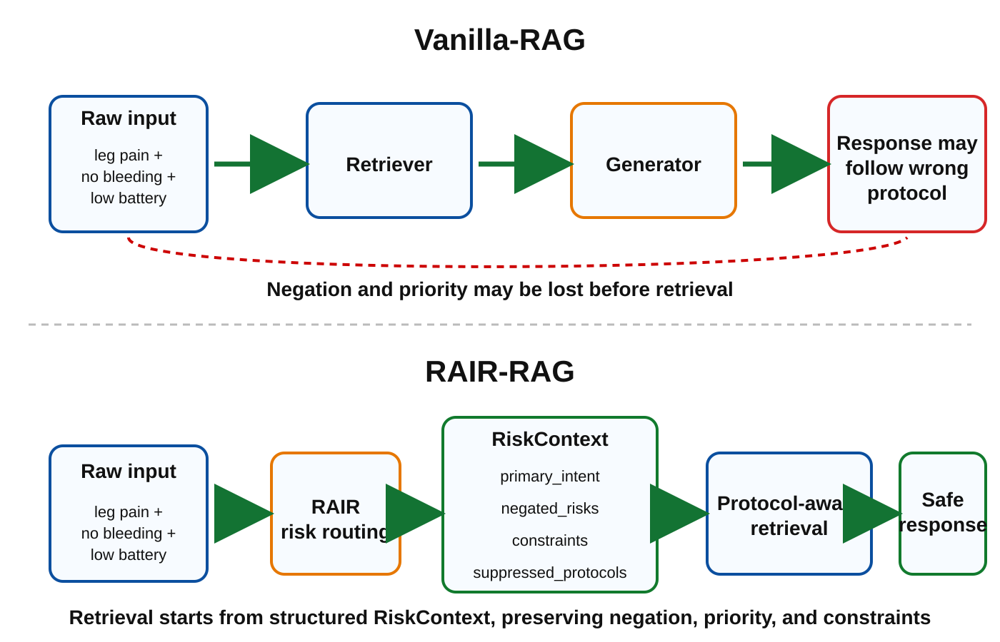
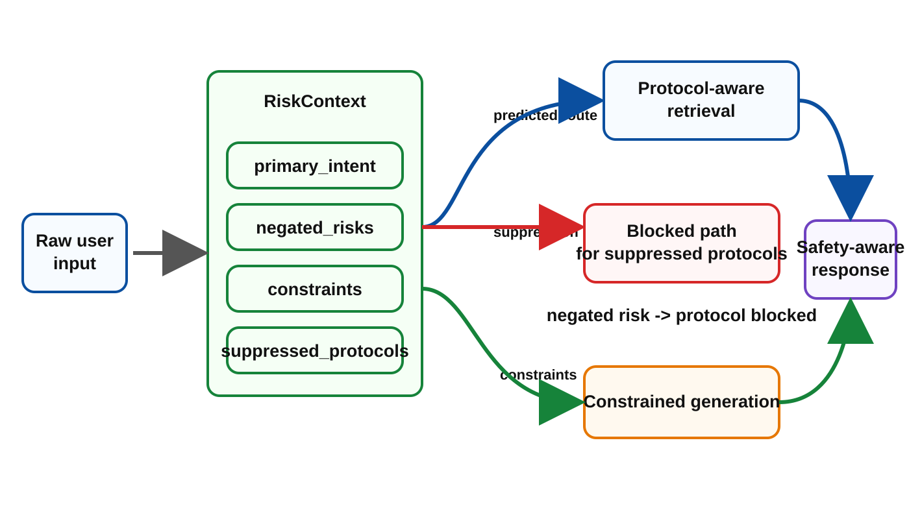
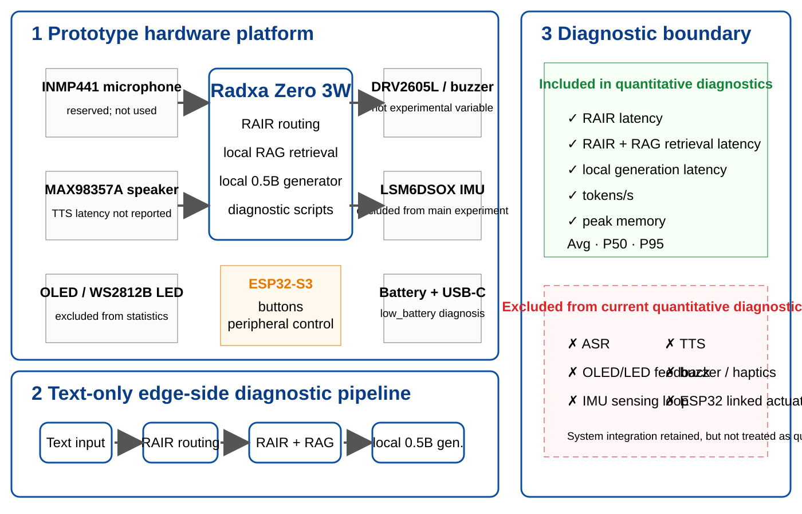
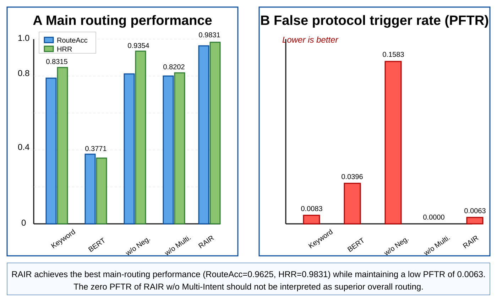
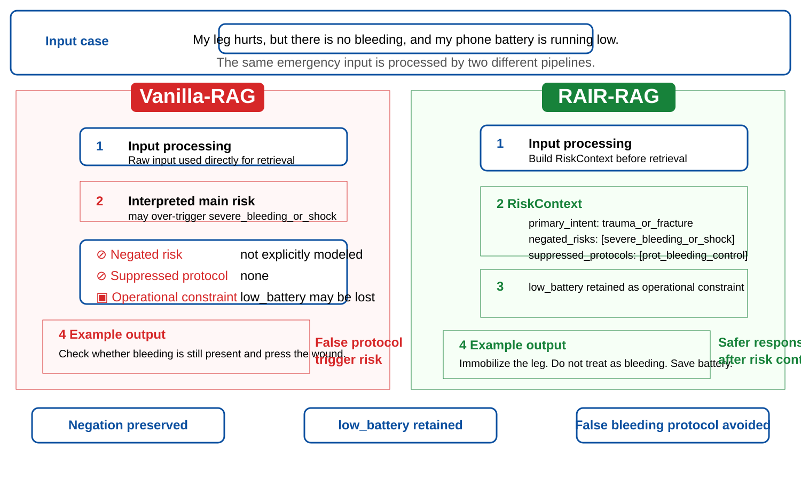

# RAIR-RAG: 面向安全关键灾害应急 RAG 的检索前风险上下文构建与安全验证

**RAIR-RAG: Pre-Retrieval Risk Context Construction for Safety-Critical Disaster Emergency RAG**

作者：江荣义  
单位：黄河科技学院  
版本：结构重构修订稿 v6 - Radxa 端侧实测、图表替换与边界修正版

## 摘要更新

本文在原 v5 稿基础上补入 Radxa Zero 3W 端侧文本生成诊断结果，并替换图 1、图 2、图 3、图 4、图 5 和图 8。端侧实验采用文本输入，不包含 ASR/TTS 与外设联动，以避免语音识别误差和硬件控制延迟干扰对检索前路由与生成安全性的评价。

在 480 条主测试样本上，RAIR 取得 RouteAcc=0.9625、HRR=0.9831、PFTR=0.0063、NegRiskF1=0.7410、SecondaryIntentF1=0.8542 和 ConstraintF1=0.9829。下游 evidence-level 检索实验中，RAIR-RAG 的 top-1 protocol-evidence 命中率为 0.0542。qwen-plus 强参考生成实验显示，RAIR-RAG 将 SafeResponseRate 从 0.1542 提升至 0.5896，将 CorrectProtocolUse 从 0.2979 提升至 0.9688。

Radxa Zero 3W 端侧文本生成诊断使用 `qwen1_5-0_5b-chat-q4_k_m.gguf`，最终采用 `RAIR patched5` 结果。480 条样本的平均时延为 14395.28 ms，P50 为 13091.36 ms，P95 为 26481.97 ms，平均 rough tokens/s 为 6.01，峰值 RSS 为 900.50 MB。patched5 输出护栏后，safe_response、correct_protocol_use、negated_risk_avoidance、high_risk_action_recall、constraint_retention 和 parse_ok 均为 1.0000，dangerous_keyword_hit 为 0.0000；low_battery_guard_count=26，suppression_guard_count=6，output_guard_count=32，bad_count=0。

## 图表替换



**图 1 Vanilla-RAG 与 RAIR-RAG 的检索前差异。** Vanilla-RAG 从原始输入直接检索，可能丢失否定和优先级；RAIR-RAG 先构建 RiskContext，再约束检索和生成。



**图 2 RiskContext 对下游检索与生成的约束关系。** RiskContext 将预测路由、抑制协议和操作约束分流到不同下游模块。


**图 3 RAIR 风险上下文构建流程。** 图中展示输入归一化、风险候选抽取、否定作用域建模、安全优先级多意图路由、RiskContext 结构化输出以及对下游 RAG 的约束。



**图 4 原型硬件平台与 Radxa 端侧诊断边界。** 蓝色表示本文定量诊断的计算链路，绿色表示报告的诊断项，灰色表示原型硬件模块，红色虚线表示当前定量实验排除边界。



**图 5 主路由结果与 PFTR 对比。** RAIR 在主路由性能上取得最高 RouteAcc 和 HRR，同时维持较低 PFTR。RAIR w/o Multi-Intent 的 PFTR 为 0 不应解释为整体更优，因为它牺牲了次级意图处理。



**图 8 Vanilla-RAG 与 RAIR-RAG 的输出差异案例。** RAIR-RAG 先构建 RiskContext，显式保留 `no bleeding`、`low_battery` 和 `prot_bleeding_control` 抑制关系，从而避免错误触发出血协议。

## Radxa Zero 3W 端侧文本生成诊断结果

| 指标 | 数值 |
|---|---:|
| num_cases | 480 |
| avg_latency_ms | 14395.2837 |
| p50_latency_ms | 13091.3554 |
| p95_latency_ms | 26481.9739 |
| avg_rough_tokens_per_second | 6.0129 |
| p50_rough_tokens_per_second | 5.8321 |
| max_rss_mb | 900.5039 |
| safe_response | 1.0000 |
| correct_protocol_use | 1.0000 |
| negated_risk_avoidance | 1.0000 |
| high_risk_action_recall | 1.0000 |
| constraint_retention | 1.0000 |
| dangerous_keyword_hit | 0.0000 |
| parse_ok | 1.0000 |
| low_battery_guard_count | 26 |
| suppression_guard_count | 6 |
| output_guard_count | 32 |
| bad_count | 0 |

最终结果文件：

```text
radxa_results/runs/radxa_20260706_115059/04_generation/rair_local_generation_summary_480_patched5.json
radxa_results/runs/radxa_20260706_115059/04_generation/rair_local_generation_predictions_480_patched5.jsonl
radxa_results/runs/radxa_20260706_115059/04_generation/final_generation_notes_480.txt
```

## 论文边界表述

可以写：

> 为验证 RAIR-RAG 关键链路在低功耗边缘设备上的可运行性，本文将 RAIR 路由模块、RiskContext 条件生成模块、本地 RAG 检索模块与量化 0.5B 本地生成器部署至 Radxa Zero 3W，并在 480 条测试样本上完成端侧文本生成诊断实验。

不能写：

> 完整硬件闭环实验已经完成。

更准确的结论是：

> 本文完成了 Radxa Zero 3W 上的 RAIR-RAG 端侧文本链路部署与 480 条生成诊断实验，验证了方法在低功耗边缘设备上的可运行性与安全护栏有效性。该实验不包含 ASR/TTS、OLED、LED、蜂鸣器、震动马达或 ESP32 外设联动。
