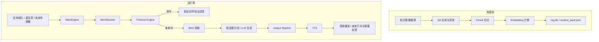

# MoniBox 项目详情文档

本文档基于当前项目工作空间整理，目标是完整说明 MoniBox 这个项目当前的软件架构、硬件形态、软硬件协同方式、模型与配置基线、TTS 方案以及当前最关键的工程矛盾。

## 项目定位与产品目标

MoniBox 面向的不是普通聊天机器人场景，而是灾害受困、断网、低算力、高风险的边缘交互场景。项目希望构建一套能够部署在端侧设备上的离线智能运行系统，使设备在缺乏网络和人工支持的情况下，仍能向受困者提供安抚、指引、问询和协议化应急响应。

这个项目的核心目标不是“尽量聪明”，而是“在高风险条件下尽量可靠”。因此它从设计上强调以下几件事：

- 离线可运行，不能依赖稳定网络。
- 协议优先，涉及安全和应急场景时优先走确定性规则，而不是把决策完全交给生成模型。
- RAG 增强，尽量让回答建立在本地知识库和结构化内容之上。
- 语音友好，面向真实终端交互，输出必须适合播报。
- 面向边缘设备，设计时要考虑 Radxa 这类低功耗板卡的资源限制。
- 预留硬件融合能力，未来不只做语音问答，还要和麦克风、扬声器、传感器、灯光和屏幕协同工作。

因此，MoniBox 更接近“离线救援陪伴终端的大脑系统”，而不是一个单独的软件应用。

## 产品形态与整体设计思路

项目当前的产品形态可以理解为一个软硬件协同的边缘智能终端。

在理想形态下，终端会至少包含以下能力：

- 语音输入：用户通过麦克风进行求助、描述症状或表达情绪。
- 语音输出：设备通过扬声器进行安抚、指导、追问和应急播报。
- 本地知识检索：设备本地保存灾害、生存、急救相关知识，以 RAG 方式检索。
- 本地生成能力：在协议未命中的情况下，用小模型对知识片段做组织和表达。
- 硬件事件感知：未来通过 IMU、按键、外设中断等信号识别环境变化或状态变化。
- 多通道反馈：语音之外，还可通过灯带、屏幕等方式进行提示和状态反馈。

整体设计上，项目采用“协议优先 + RAG 补充 + 生成润色”的结构。也就是说：

- 高风险场景优先走协议，不允许模型自由发挥。
- 非协议场景优先从本地知识库检索，再组织成简洁可播报的回答。
- 在知识不足或证据较弱时，系统会走低证据分流和保守输出，而不是强行生成看起来很完整的答案。

这意味着项目从一开始就是按“可控的产品系统”而不是“开放式对话系统”来设计的。

## 系统总体架构设计

项目整体可以分成两个大域：构建侧和运行侧。

### 建侧

构建侧主要负责把知识材料转成适合端侧检索和播报的资产，最终产物主要是：

- `build/rag.db`
- `build/runtime_pack.json`
- 对应的模型文件目录

构建侧的核心工作包括：

- 生成或整理知识源数据
- 把问答或知识内容切成更适合 TTS 播报的短片段
- 计算 embedding
- 把片段、向量、元信息写入 SQLite + sqlite-vec
- 产出运行时所需的标签、来源和配置包

### 行侧

运行侧负责把设备上的输入转化为响应。当前运行侧核心能力包括：

- 文本输入
- 麦克风 + VAD 语音输入
- ASR 语音识别
- 协议匹配
- RAG 检索
- LLM 生成或回退
- TTS 语音合成
- 音频播放
- 运行态性能与状态协调

### 体架构图



## 软件架构设计详情

### 口层

项目当前的主要入口位于 `apps/` 目录。

- `apps/runtime_edge.py`
  当前推荐运行时入口，支持 `text` 和 `mic_vad` 两种模式。
- `apps/chat.py`
  偏向纯文本的 RAG / RAG + LLM 调试入口。
- `apps/win_e2e_demo.py`
  早期的 Windows 端到端语音验证入口，现在仍可用于补充验证，但不建议作为主线入口。
- `apps/win_e2e_queue.py`
  更偏向队列式音频链路的实验入口。

当前主线是 `runtime_edge.py`，其职责不是直接承载业务逻辑，而是负责启动 `MainEngine` 并提供文本模式或 VAD 语音模式的运行壳。

### 行时协调层

运行时协调层主要由 `monibox/core_loop/engine.py` 承担。

`MainEngine` 的职责包括：

- 启动全局资源预加载
- 创建 `MoniSession`
- 启动 ASR 线程、音频播放线程和协调线程
- 在语音模式下处理“监听、识别、播报、暂停、恢复”的调度关系
- 在单轮模式下保证“处理完一轮并播放结束后再退出”

这一层是从“系统运行”角度组织所有模块，而不是从“单次对话逻辑”角度组织。

### 话编排层

会话编排核心位于 `monibox/runtime/orchestrator.py` 中的 `MoniSession`。

`MoniSession` 是当前最关键的业务编排器，负责把下列子能力串起来：

- `RagEngine`
- `ProtocolEngine`
- `SafetyGuard`
- `LowEvidenceRouter`
- `WorkingMemory`
- `ResponseRewriter`
- `OutputPipeline`
- `ProtocolHandler`
- `RagGenerator`
- `PerfMonitor`

它的主职责是：

- 接收一次用户输入
- 先做协议判定和协议状态处理
- 未命中协议时做 RAG 检索
- 识别低证据场景并分流
- 调用 LLM 组织回复或回退
- 对回复进行改写、重复抑制、安全处理
- 最终交给 TTS 和输出链路

### 块分层

从当前代码来看，软件架构可以概括为以下几层：

- 入口与启动层：`apps/`
- 运行协调层：`monibox/core_loop/`
- 会话与策略层：`monibox/runtime/`
- 模型能力层：`monibox/llm/`、`monibox/asr/`、`monibox/tts/`
- 音频与硬件抽象层：`monibox/audio/`、`monibox/hw/`
- 构建与数据工具层：`scripts/`

### 件抽象层

`monibox/runtime/hardware_iface.py` 当前定义了一个很重要的方向：项目已经明确预留了真实硬件接口层。

现有抽象能力包括：

- `tts(text, style)`
- `led(pattern)`
- `screen(text, ms)`

当前代码中以 `MockHardware` 为主，说明项目在软件设计上已经将真实终端外设考虑进来了，但 Radxa 侧的完整硬件实现还未彻底落地。

## 核心运行链路

### 本交互链路

文本模式当前通过以下命令进入：

```bash
python -m apps.runtime_edge --mode text
```

基本链路为：

```text
用户输入文本
-> runtime_edge
-> MainEngine
-> MoniSession.handle()
-> 协议匹配
-> RAG 检索 / 低证据分流 / LLM 生成
-> 输出改写与安全处理
-> 控制台输出
```

文本链路的意义主要是：

- 不依赖麦克风和扬声器
- 适合验证协议、RAG、低证据策略和主逻辑
- 即使真实 LLM 未配置，也可以用 `null` backend 跑通主链逻辑

### 音交互链路

语音模式当前通过以下命令进入：

```bash
python -m apps.runtime_edge --mode mic_vad
```

其运行逻辑为：

```text
麦克风输入
-> VAD 监听
-> ASRWorkerThread 识别
-> input_queue 推送 TEXT_IN
-> MainEngine session_loop
-> MoniSession.handle()
-> 协议 / RAG / LLM / 输出处理
-> TTS 合成
-> output_queue
-> AudioPlayerThread 播放
```

如果只是做单轮闭环验收，可以使用：

```bash
python -m apps.runtime_edge --mode mic_vad --once
```

### 件事件链路

硬件事件链路目前在架构上已经存在，但还没有完全进入主线实现。

目标链路大致是：

```text
传感器或外设事件
-> 语义化事件
-> Session / Protocol Engine
-> 抢占当前普通对话
-> 触发协议动作
-> TTS / 灯带 / 屏幕联动
```

从已有文档和接口设计来看，未来的关键不是“硬件采样”本身，而是把硬件事件纳入运行时优先级体系，使其能够打断低优先级对话行为。

## 当前硬件基础与部署形态

### 前开发与验证环境

当前项目主要在 Windows PC 环境下进行开发、调试和全链路验证。这个阶段的硬件基础主要是：

- Windows 主机
- CPU 推理环境
- 麦克风
- 扬声器或耳机
- 本地模型目录

从现有脚本和准入检查来看，Windows 侧已经能够承担以下职责：

- 文本模式主链验证
- ASR -> Session -> TTS 的语音闭环验证
- 本地模型加载测试
- TTS 质量与音色扫描测试

### 标部署硬件

项目目标部署载体是 Radxa Zero 3W 一类边缘板卡。现有文档中明确提到：

- 平台：Radxa Zero 3W
- 系统：Debian / Ubuntu ARM64
- 内存：8GB 更稳妥

Radxa 在项目中的角色不是“另一个开发环境”，而是未来真实产品运行环境。也就是说，项目的软件架构、模型选型和 TTS 策略，最终都要为这类低功耗边缘硬件服务。

### 前部署形态的本质

可以把当前状态理解为：

- Windows 侧：主开发、主调试、主验证平台
- Radxa 侧：目标运行平台、性能与协同真实性平台

因此，当前项目其实处在“Windows 主线验证已经形成，Radxa 目标收敛仍在推进”的阶段。

## 未来硬件扩展规划

结合当前代码和现有文档，后续硬件扩展方向已经比较明确。

### 频外设

- 麦克风
- 扬声器

这是当前已经进入主链的硬件类型，也是整套交互系统的基础。

### 感器类硬件

- IMU / 震动传感器
- 可能的环境感知类传感器
- 可能的按压或中断型输入

这些硬件未来的重点作用不是做复杂感知，而是提供高优先级事件信号，让系统具备“环境变化时强制介入”的能力。

### 馈类硬件

- LED 灯带
- OLED 屏幕或其他小型显示器

这些硬件会承担补充反馈能力，例如：

- 当前状态提示
- 紧急警示
- 交互阶段提示
- 非语音场景下的辅助反馈

### 件扩展的产品意义

这些外设的加入，不是为了“炫技”，而是为了让终端在真实灾害环境下具备多通道输出能力。语音可能会受噪音、距离、情绪或环境条件影响，多通道反馈可以显著提升产品有效性。

## 软硬件协同机制

这一部分是 MoniBox 和普通软件项目差异最大的地方。项目不是简单地调用几个模型，而是在努力建立一套“边缘设备上可运作的协同机制”。

### 音输入与语音输出的协同

当前 `MainEngine` 中已经有明确的协调线程逻辑：

- 当 TTS 正在播放，ASR 线程会被暂停。
- 当音频播放队列清空后，ASR 才恢复监听。
- 在进入监听前还有 arm delay 和 post arm guard 两段保护时间。

这说明项目已经非常明确地在解决一个实际问题：如果 TTS 播放和 ASR 监听不协调，系统就会把自己的声音重新听进去，造成自激、误触发和音频设备争用。

### 议优先与硬件事件抢占

当前运行时已经有协议优先级和抢占逻辑。`MoniSession` 中会比较新协议和当前协议状态的优先级，必要时清空当前状态并执行抢占。

这为未来硬件事件接入留下了非常关键的基础：当 IMU、外设中断或其他事件上来时，系统可以不是“把它当普通输入”，而是把它作为更高优先级的行为来源处理。

### 通道反馈协同

从硬件接口抽象可以看出，未来系统输出不只是一段 TTS 文本，而可能是：

- 一段语音
- 一个灯带模式
- 一段屏幕文字

这意味着未来一个协议动作可以天然是多通道的。例如：

- TTS 提示用户掩护
- LED 闪烁加强警示
- 屏幕显示关键短句

### 缘资源约束下的协同

项目设计里还有一个非常重要的隐性要求：所有这些协同都必须在低资源设备上成立。

因此，软硬件协同不仅是“功能打通”，还包括：

- 线程数控制
- 播放与监听时序协调
- 长句切短以改善首包体验
- 尽量使用本地单文件数据库和轻量依赖
- 模型加载与常驻策略

换句话说，MoniBox 的协同机制本质上是一套“资源受限条件下的交互调度设计”。

## 当前技术栈、模型与配置基线

### mbedding 与知识检索

当前项目实际使用的 embedding 模型是本地目录下的：

- `models/embedding/bge-small-zh-v1.5`

对应配置基线来自 `.env.example`：

- `EMBEDDING_MODEL=models/embedding/bge-small-zh-v1.5`

RAG 存储采用：

- SQLite
- `sqlite-vec`

运行时核心产物为：

- `build/rag.db`
- `build/runtime_pack.json`

这是一个明显偏嵌入式友好的方案，优点是单文件、轻依赖、便于迁移到边缘设备。

### LM 方案

LLM 后端当前通过 `monibox/llm/backends.py` 统一抽象。

支持的主要模式有：

- `deepseek`
- `llama`
- `auto`
- `null`

自动模式的选择逻辑是：

- 有 `LLM_GGUF_PATH` 就优先走本地 `llama`
- 没有本地 GGUF，但有 DeepSeek key，就走 `deepseek`
- 都没有则回退到 `null`

当前仓库中已经存在本地 GGUF 模型：

- `models/llm/qwen1_5-0_5b-chat-q4_k_m.gguf`

对应 `.env.example` 中的基线配置为：

- `LLM_GGUF_PATH=models/llm/qwen1_5-0_5b-chat-q4_k_m.gguf`
- `LLM_CTX=2048`
- `LLM_THREADS=6`
- `LLM_GPU_LAYERS=0`
- `LLM_CHAT_FORMAT=chatml`
- `LLM_TEMPERATURE=0.3`

从定位上看：

- Windows 开发期可用 DeepSeek 作为外部后端
- 端侧部署目标更偏向本地 GGUF + llama.cpp

### SR 方案

当前仓库中已经存在本地 ASR 模型：

- `models/asr/faster-whisper-small`

准入检查脚本 `scripts/check_stage_d_readiness.py` 也明确把它作为语音主线检测对象。

这说明当前 ASR 主线是：

- `faster-whisper`
- 本地模型目录 `models/asr/faster-whisper-small`

### TS 方案

当前推荐 TTS 主线是：

- `sherpa-onnx`

运行时代码中也保留了兼容后端：

- `pyttsx3`
- `sapi`

但从阶段 D 准入检查的判断逻辑来看，推荐主线明确是 `sherpa`，因为它和当前的队列播放、ASR pause、语音闭环协调路径更一致。

### 前运行时配置基线

`monibox/runtime/runtime_config.py` 中当前默认基线包括：

- `rag_max_distance=0.42`
- `low_evidence_mode=True`
- `tts_max_chars=90`
- `tts_backend=pyttsx3`
- `tts_sherpa_model_dir=models/tts/sherpa/vits-icefall-zh-aishell3`
- `tts_sherpa_model_type=melo`
- `tts_sherpa_threads=4`
- `tts_sherpa_cache_size=100`
- `tts_sherpa_speed=1.0`
- `tts_sherpa_sid=173`
- `tts_sherpa_noise_scale=0.667`
- `tts_sherpa_noise_scale_w=0.8`
- `llm_temperature=0.3`
- `repeat_threshold=0.92`
- `perf_warning_mb=600`

这里有一个很值得注意的事实：代码默认 `tts_backend` 仍是 `pyttsx3`，但语音主线验证已经明确推荐 `sherpa`。这说明项目当前存在“默认配置”和“推荐主线”还未完全收敛的问题。

## TTS 方案与专项质量评测

### 当前 TTS 技术方案

当前项目的主 TTS 思路是基于 `sherpa-onnx` 构建离线语音合成能力，并将其纳入运行时输出链路。与普通桌面 TTS 不同，这套方案是为边缘设备和离线运行准备的。

项目里当前保留了多个 TTS 相关模型目录：

- `models/tts/sherpa/vits-icefall-zh-aishell3`
- `models/tts/sherpa/vits-melo-tts-zh_en`
- `models/tts/piper/...`

从当前代码和文档判断：

- `sherpa-onnx` 是主线引擎
- `aishell3` 是当前重点测试和推荐的多音色中文模型
- `melo` 保留为对比与移植方案
- `pyttsx3` 和 `sapi` 更像兼容或过渡路径

### TTS 在系统中的位置

当前 TTS 并不是一个孤立模块，而是运行时输出链的一部分：

```text
Session 回复
-> OutputPipeline
-> TTS
-> output_queue
-> AudioPlayerThread
-> 扬声器播放
```

这意味着 TTS 不仅要“能发声”，还要与以下能力协同：

- 输出改写和压缩
- 句长控制
- 重复抑制
- 音频队列播放
- ASR 暂停与恢复

### 当前 TTS 模型与参数基线

当前默认 sherpa 模型目录配置为：

- `models/tts/sherpa/vits-icefall-zh-aishell3`

当前默认 sherpa 参数基线为：

- `TTS_SHERPA_THREADS=4`
- `TTS_SHERPA_SPEED=1.0`
- `TTS_SHERPA_SID=173`
- `TTS_SHERPA_NOISE_SCALE=0.667`
- `TTS_SHERPA_NOISE_SCALE_W=0.8`
- `TTS_SHERPA_CACHE_SIZE=100`

此外，代码中 `TTS_SHERPA_MODEL_TYPE` 的默认值为 `melo`，而模型目录默认指向 `vits-icefall-zh-aishell3`。这说明当前 TTS 配置命名和模型抽象还需要进一步统一和固化。

### 当前 TTS 质量评测方式

当前仓库中已经保留了较完整的 TTS 专项测试脚本，覆盖了以下几类需求：

- 全量音色扫描
- 代表性音色性能测试
- 模型加载可用性测试
- Melo 模型加载与路径兼容测试

推荐保留在文档中的运行命令如下。

#### ell3 全量音色扫描与试听

```bash
python scripts/browse_aishell3_voices.py
```

用途：

- 遍历 `aishell3` 的多音色 `sid`
- 保存合成结果
- 边生成边播放
- 用于人工挑选更合适的说话人音色

#### ell3 代表性音色性能与 RTF 测试

```bash
python scripts/eval_aishell3.py
```

用途：

- 对代表性 `sid` 做合成
- 输出合成耗时
- 输出 RTF
- 便于比较不同参数和不同机器上的表现

#### ell3 模型加载测试

```bash
python test_aishell3.py
```

用途：

- 快速检查 `sherpa-onnx` 是否能正确加载 aishell3 模型文件

#### 模型加载测试

```bash
python test_melo.py
```

用途：

- 快速验证 `vits-melo-tts-zh_en` 是否能在当前环境中被正确加载

#### 路径兼容性测试

```bash
python test_melo_en_path.py
```

用途：

- 检查特定英文路径下的模型加载兼容性问题

### 当前 TTS 质量与性能结论

结合现有文档和测试代码，可以得出当前 TTS 方向上的几个结论：

- 项目已经明确不把桌面 TTS 当作长期主线，而是转向 `sherpa-onnx`。
- `aishell3` 之所以重要，不只是因为音色多，还因为它在边缘板卡上的实时性更接近可用。
- `melo` 在质量层面有吸引力，但在 Radxa 这类设备上的资源代价更大。
- TTS 的问题从来不只是音质，而是“音质、延迟、资源占用、闭环稳定性”四者之间的平衡。

## 当前核心痛点与关键技术矛盾

### 情感语音合成质量与边缘设备资源之间的矛盾

这是当前最核心的矛盾之一。

项目希望终端的声音不是单纯机械播报，而是具有一定安抚感和情绪表达能力。但越强调音质和表现力，通常模型越重、推理越慢、资源占用越高；而项目最终又必须跑在 Radxa 这类低算力边缘设备上。

这就形成了典型冲突：

- 想要更自然、更有情感的声音
- 但设备要求低时延、低资源占用、可持续运行

### 离线能力与模型效果之间的矛盾

项目定位决定了它不能把关键能力建立在联网基础上。但一旦强调完全离线，LLM、ASR、TTS 的模型能力就必须受到设备和本地部署的约束，效果上天然会比云端模型更保守。

因此项目面临的是：

- 一方面必须保持离线独立可运行
- 另一方面又不能让体验下降到不可接受

### 实时交互与多模块串联时延之间的矛盾

完整语音链路包含：

- VAD
- ASR
- 协议 / RAG / LLM
- TTS
- 音频播放

这些环节串联后，任何一段稍慢，都会放大整体等待感。尤其是在边缘设备上，系统不是只跑一个模块，而是多个模块同时争抢 CPU、内存和音频设备。

### 语音闭环稳定性与音频设备争用之间的矛盾

项目当前已经显式处理“播放时暂停 ASR”这个问题，说明这不是理论问题，而是真正的主线矛盾。如果处理不好，就会出现：

- TTS 播报被 ASR 误识别
- 自身声音形成回授
- 音频设备冲突
- 语音链路不稳定

### 默认配置与推荐主线尚未完全收敛

当前代码默认值、测试主线和文档建议之间还存在一些未完全统一的地方，例如：

- 默认 `tts_backend` 还是 `pyttsx3`
- 阶段 D 推荐主线已经转向 `sherpa`
- sherpa 默认模型目录与模型类型命名还不完全一致

这类问题不会立刻阻断开发，但会持续增加维护成本和理解成本。

### Windows 开发验证与 Radxa 真实部署之间的落差

当前项目很多能力已经能在 Windows 上跑通，但真正的产品可信度仍取决于目标硬件上的表现，包括：

- 时延
- 内存占用
- 长时间稳定性
- 温度和降频
- 音频输入输出实际效果

所以当前项目还存在明显的平台收敛压力。

## 当前急需解决的问题

### 固化 TTS 主线方案

目前最需要尽快收敛的是：

- 最终主线是不是明确以 `sherpa-onnx + aishell3` 为主
- 还是保留 `melo` 作为高质量方案、另设条件切换
- 当前默认配置、脚本、文档是否统一

如果这件事不尽快固化，后面所有语音链路稳定性验证都会持续漂移。

### 在目标硬件上完成真实闭环验证

Windows 跑通不等于产品可交付。当前非常需要在 Radxa 一类目标硬件上验证：

- ASR 是否稳定
- TTS 是否可接受
- 整体时延是否可接受
- 多模块同时运行是否稳定

### 完成硬件事件接入主线

项目已经不是一个纯文本或纯语音系统，真正的产品竞争力在于协议与硬件中断协同。当前这一部分仍然更多停留在架构预留和文档规划阶段，离完整主线还有距离。

### 收敛配置基线与运行基线

当前项目已经有：

- `.env.example`
- `runtime_config.py`
- 各类脚本内默认值

但仍然需要统一以下问题：

- 默认主入口是什么
- 默认 TTS 后端是什么
- 默认模型目录与参数是什么
- Windows 基线与 Radxa 基线是否要分开维护

### 做系统级性能画像

当前项目已经有性能监控和阶段性准入检查，但还需要更系统地沉淀：

- CPU 占用
- 内存占用
- 线程数与并发行为
- RTF
- 长时间运行稳定性
- 边缘设备温升和降频风险

## 当前阶段结论与下一步方向

从当前工作空间可以看出，MoniBox 已经不是概念性原型，而是一个结构清晰、主链明显、方向明确的边缘智能终端运行系统雏形。

它已经形成了几个比较扎实的基础：

- 文本主链已经可以稳定验证协议、RAG、低证据分流和输出逻辑。
- 语音主链已经形成了以 `runtime_edge + MainEngine + MoniSession` 为核心的统一入口。
- 本地模型、知识库、ASR、TTS、播放队列和会话编排都已经进入同一套运行框架。
- 架构上已经明确朝“协议优先 + 离线 RAG + 小模型生成 + 硬件协同”的产品方向演进。

同时，它也仍处在一个典型的“从可跑到可交付”的中段阶段。真正决定后续走向的关键，不再只是继续加功能，而是尽快完成以下收敛：

- TTS 主线方案收敛
- 目标硬件上的真实性能验证
- 软硬件协同主线落地
- 默认配置与推荐配置统一

如果把当前阶段做一个简洁判断，可以这样概括：

MoniBox 当前已经完成了从“想法”到“系统雏形”的跨越，接下来最重要的任务，是把它从 Windows 上可验证的离线语音知识系统，进一步收敛成真正能在边缘硬件上稳定运行的产品级架构。
